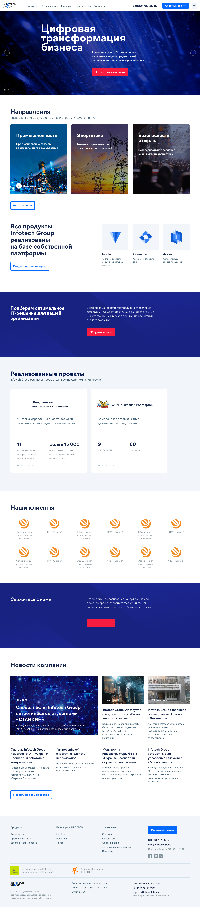
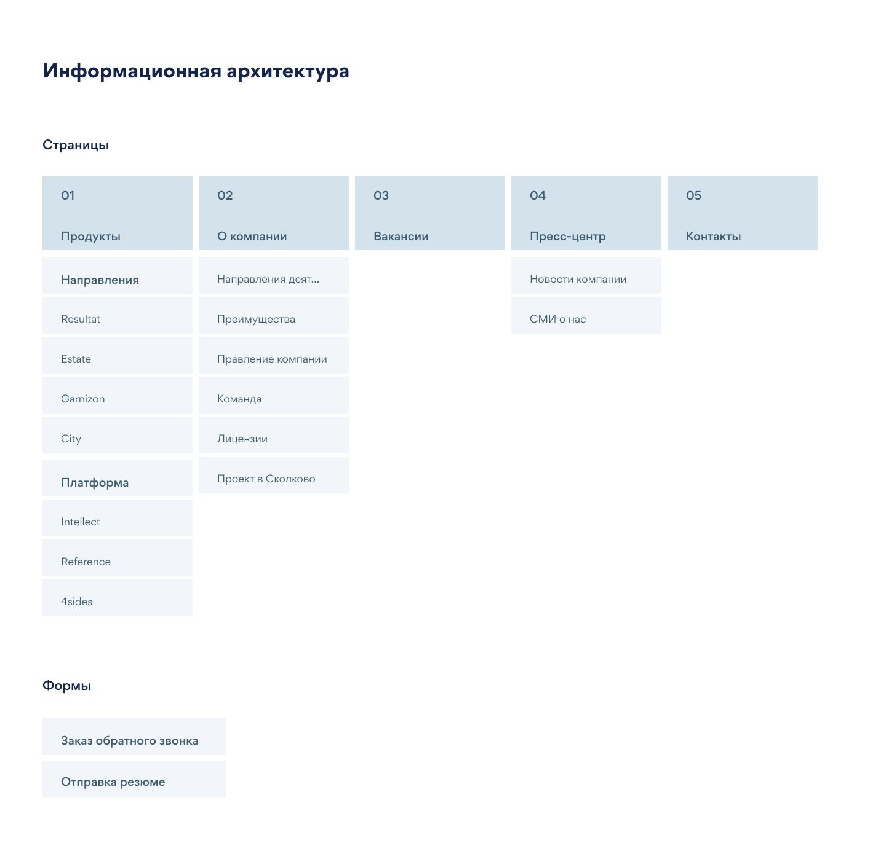
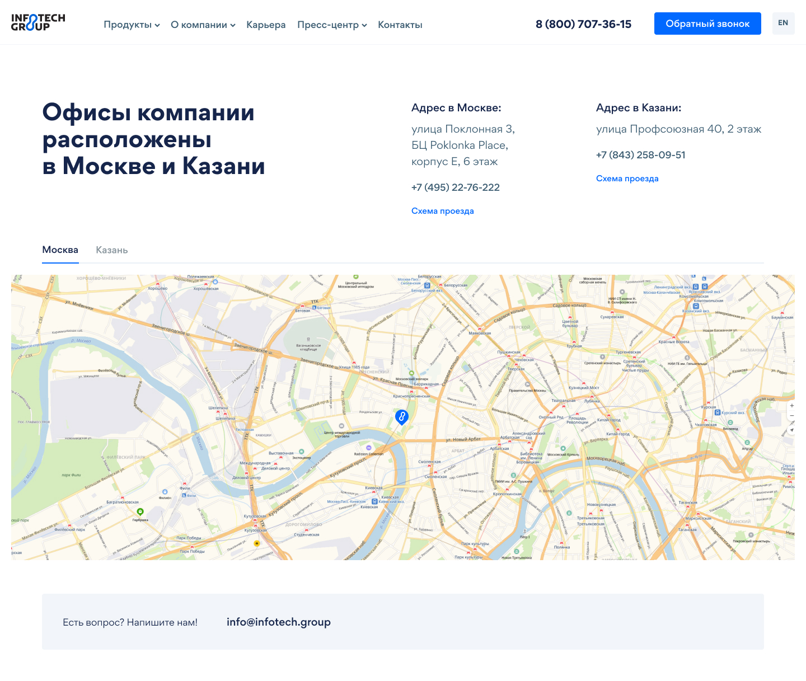
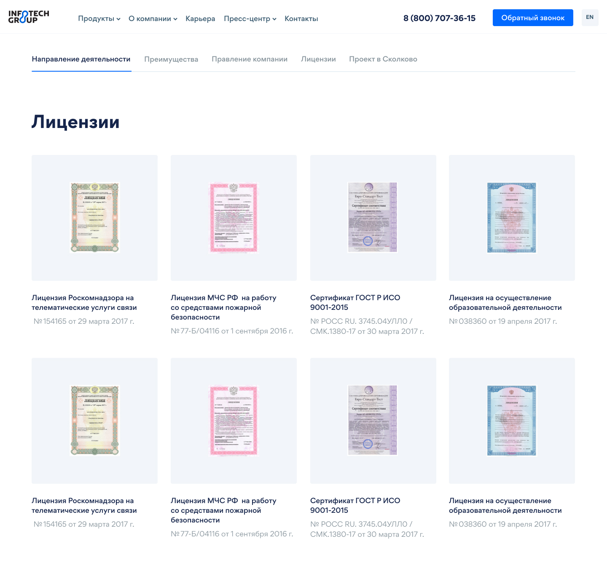
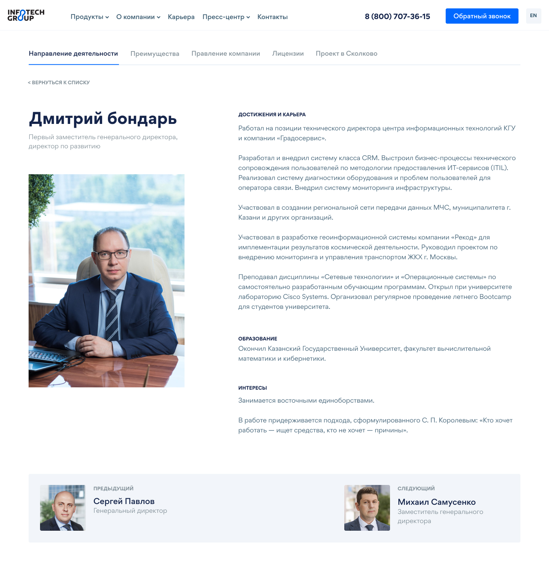
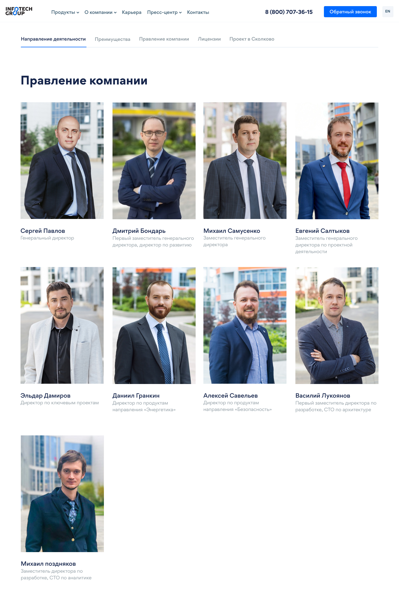
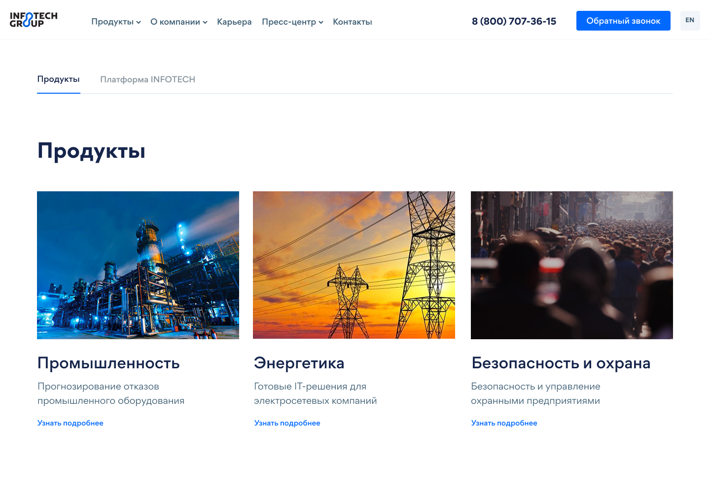

# Corporate site development for Infotech

This project required a complete redesign of the site for the Infotech company. The current site was written in Java and did not triple the company for some reasons, such as:
* outdated design
* difficulty in administration
* difficulties to change content
* there was no admin panel for the content manager

The solution to this issue was the use of CMS Wordpress, and it was with this requirement that the company came forward.

 

## Архитектура проекта

The project required to leave the architecture unchanged. In the diagram you can see it in detail.

## Team 

3 people worked on this project: programmer (I), designer and manager. We actively communicated to solve all the problems of the project. Our workflow was like that. Once a week, we organized a video call where we set priorities for goals and objectives for a week, discussed subtleties, shortcomings, mistakes and improvements. We also created a general chat, where we solved small problems.

 

 ## Development Process and Tools
 
To manage content, the company chose CMS Wordpress. On it I developed the product. In turn, I used the following tools:
 * Html
 * Css
 * Javascript
 * Jquery
 * Animate.css
 * OwlCarousel
 * Webpack
 * SmartGrid
 
 In Wordpress itself, "Advanced Custom Fields" was used to create custom fields. In order for the manager and designer to see the result of my work, it was decided to upload the result to a test server. Well, that with PHPStorm, this is real.
 
  
 
 ## Result
 
The result is a website where you can easily and intuitively change information, update data. The site has a modern design that emphasizes the status of the company and gives confidence.
 
 Then you can see how the pages of the site look.
 

